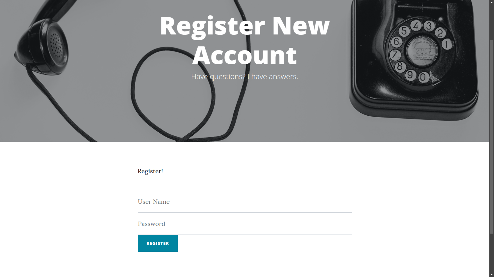

# Book : [Beginning Node.js, Express & MongoDB Development](https://www.amazon.com/Beginning-Node-js-Express-MongoDB-Development/dp/9811480281)

## Home page

- 

## create-blog page

- 

## post page

- 

## Register page

- 

## login page

- 

- [source-code by greglim](https://github.com/greglim81?tab=repositories&q=express_&type=&language=&sort=)

## Topics covered:

- user auth, data validation, async js, password hashing, Express, mongo, template engine, maintaining user session
- log out, new post

# Chapter-1: Introduction (group-1)

### What is nodejs?

- client makes a resqueest and server responds with html
- server side languages: node, php, ruby, python,...
- MEAN stack: mongo, express, Angular, Node
- MERN stack: use react as front end instead of angular

# Chapter 2 Intro. npm and express (group-1)

## Creating our first server

- we call the function request handler

## express js

- got to `npmjs.com` and search for express
- package.json to track all package and their versions used in our app.
- `npm install express`
  or
  `npm install pnpm`
  `pnpm install express`
- `npm init` : generates package.json for us

```
const express=require('express');   // require express module
const app = express();   // calls express function to start new Express app

app.listen(3000, () =>{
    console.log("Ap listening on port 3000");
})
```

`node index.js`

# Chapter 3 (group-2)

- use nodemon on dev to auto detect changes
- blog template from [startbootstrap](https://startbootstrap.com/theme/clean-blog)
- Add "scripts to package.json" and use `pnpm start` to run the code.

# chapter 4 (group-2)

- use ejs for template engine
- reusable template layouts: header, footer, navbar, scripts

# Chapter 5 (group-2)

- mongodb
- mongodb compass
- CRUD: Create, Read, Update, Delete

# Chapter 6 (group-2)

- data from mongo: post, date
- [ ] make search function work

# Chapter 7: image file upload (group-2)

- use
- `enctype="multipart/form-data"` in form tells browser form contains multimedia data

# Chapter 8: Express Middlewares (group-2)

- middlewares are functions express executes in the middle after request which produce output that can be final output or be used by next middleware.
- // "Custom middleware called" will be displayed every time you refresh the app.

// apply this middleware for specific url pattern (specific request).
app.use('posts/store', validateMiddleWare);

```

- Good use case: form validation
```

# Chapter 9: Refactoring to MVC (group-3)

- Model view controller
  Model: structure of the data
  View: what is presented to the user (e.g. ejs files)
  Controller: controls requests of user and genereate appropriate response

- user interacts with view, which genereates appropriate request which is handele by controlller which then renders the appropriate view with Model data as response.

- in this chapter, we will refactor controller layer
- `controllers/newPost.js`

# Chapter 10: User Reginsration (group-4)

- user interacts with view, which genereates appropriate request which is handele by controlller which then renders the appropriate view with Model data as response.

## encrypt the password

- mongoose model hook (hook is just a middleware)
- `npm i bcrypt --save` to encrypt passwords
- [ ] todo: error: bcrypt MODULE_NOT_FOUND

# Chapter 11: User authentication with session (group-4)

## Summary:

- user sessions
- display conditional login, logout icons
- 404 not found page

# Chapter 12: Showing validation errors (group-5)

- validation errors

# Chapter 13: Relating Posts with User Collection (group-6)

- displaying username (from logged-in user session).

# Chapter 14: (group-6)

- WYSIWYG Editor for user to format the blog post
- WYSIWYG: What you see is what you get.
- HTML editor: summernote.org/getting-started/#for-bootstrap-4

# Chapter 15: MongoDB atlas

- Create [mongodb on atlas](https://cloud.mongodb.com/) and replace uri in index.js

# Chapter 16: Deploying to heroku
